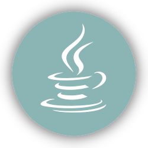

<h1></h1> 
<h2 > ❤️ Code Lover ❤️</h2> 

I'm 26 years old a Full Stack Developer at <strong><a href="https://makolab.com">Makolab S.A.</a></strong>
 I'm working on several side projects, learning new dishes, and trying to learn new and interesting technologies whenever I have free time.

<h1></h1> 

<h2 >💼 I’m currently working on</h2>

<ul>
<li><a href="https://github.com/edmcouncil/onto-viewer">OntoViewer</a> - an open source Java application designed to access Ontology content in the simplest way possible </li>
<li> My portfolio website - VUE + Strapi + mongoDB</li>
<li> Utility Discord Bot </li>
</ul>

<h2 >🔭 Learning about</h2>
<ul>
<li>nuxtjs </li>
<li>Strapi</li>
<li>Bulma</li>
</ul>

<h2 >🚧 I'm going to learn</h2>
<ul>
<li>React</li>
<li>Kubernetes</li>
<li>Grafana - monitoring servers and their resources</li>
</ul>

<h2 >🎲 Hobbies </h2>

<ul>
<li> Gaming Addict</li>
<li> Watching Anime</li>
<li> I love playing board games </li>
</ul>
<h1></h1> 
<h2 >🚀 Some Tools I Use</h2>

<h2>Programming Languages:</h3>

<h1></h1> 
<h2>Frontend Development:</h2>

<h1></h1> 
<h2>Backend Development:</h2>

 

<h1></h1> 
<h2>Database:</h3>

<h1></h1> 
<h2>Devops:</h3>

<h1></h1> 
<h2>📫 Contact me</h2>

<ul>
<li> email:  <a href="mailto:michal.19.daniel.96@gmail.com">michal.19.daniel.96@gmail.com</a> </li>
<li>text to me on Discord <strong>Mychau#0001</strong></li>
</ul>
<h1></h1> 

&nbsp;

<h1></h1>
<h2>Links to the tools I used to create this readme</h3>
<a href="https://simpleicons.org/" style="color: #8AB5B4;">icons</a> | <a href="https://github-readme-streak-stats.herokuapp.com/demo/" style="color: #8AB5B4;">github-readme-streak-stats</a> |  <a href="https://github.com/anuraghazra/github-readme-stats" style="color: #8AB5B4;">github-readme-stats</a> | <a href="https://codepen.io/sosuke/pen/Pjoqqp" style="color: #8AB5B4;">CSS filter generator</a> | <a href="https://emojipedia.org" style="color: #8AB5B4;">emojipedia.org</a>

